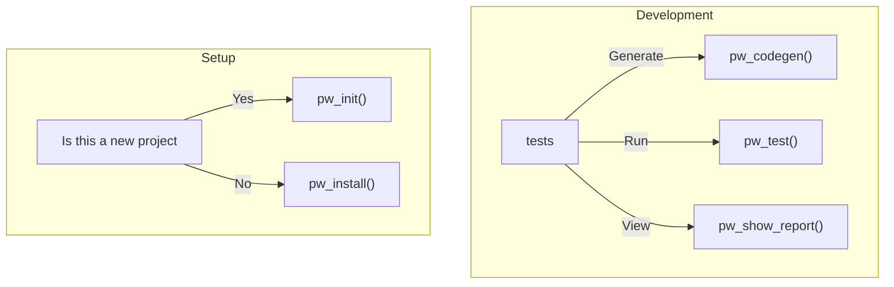

# pw

<!-- badges: start -->

[](https://lifecycle.r-lib.org/articles/stages.html#experimental)
[](https://github.com/ThinkR-open/pw/actions/workflows/R-CMD-check.yaml)

<!-- badges: end -->

The purpose of `{pw}` is to streamline the use of [Playwright](https://playwright.dev/) for testing your `{golem}` applications.

## Installation

You can install the development version of `{pw}` like so:

```r
pak::pak("thinkr-open/pw")
```

## Workflow



### Requirements

- Ensure that **npm** (with **npx**) is installed on your computer.
- You must be working within a `{golem}` project.
- The default test structure should be present (if not, run `usethis::use_testthat()` to set it up).

### Initializing Playwright Testing

To set up Playwright testing in your `{golem}` project, execute the following command:

```r
pw::pw_init()
```

This function will:

1. Run `npx create-playwright@latest` in the `tests/playwright` folder.
2. Add the following files to your project:
   - `tests/playwright/playwright.config.ts` (updated)
   - `tests/playwright/tests/default.test.ts` (created)
   - `tests/testthat/test-playwright.R` (created)

After setup, run `devtools::test()` to confirm that everything is functioning correctly

### Running the Tests

To execute the Playwright tests, use the following command in R:

```r
pw::pw_test()
```

### Writing Your Own Tests

To create or modify tests, edit the file `tests/playwright/tests/default.test.ts` or add new test files in the same directory to extend your Playwright test suite.

### Running Playwright Commands from the Terminal

For manual execution of Playwright commands, navigate to the `tests/playwright` directory:

```bash
cd tests/playwright
npx playwright test
```

## Roadmap

- [ ] Enable viewing of test reports directly.

**Note:** The full Playwright Node.js API will not be wrapped in R. For advanced use cases, you may need to run commands directly from the terminal.
